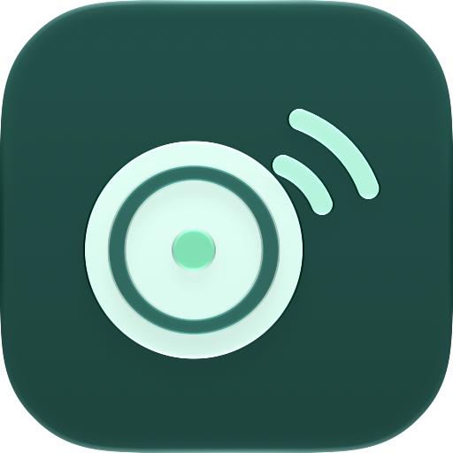

# RuuviMac

An independent, open-source native SwiftUI macOS MVP for nearby RuuviTags.



## Official app check — October 3, 2026

No official native macOS app was found. Ruuvi's [Station page](https://ruuvi.com/station/) advertises Android, iOS, and a cloud web app. The [official App Store listing](https://apps.apple.com/us/app/ruuvi-station/id1384475885?platform=mac) lists iPhone, iPad, and Apple Vision compatibility, with no Mac entry. This is a point-in-time finding, not a guarantee about future releases or every regional store. The web app is an existing option for Mac users with cloud-connected sensors.

## Features

- CoreBluetooth discovery with duplicate advertisements enabled; no pairing, internet account, or Gateway required.
- Official Ruuvi BTKit RAWv2 decoder, vendored from a pinned revision with documented macOS build guards.
- Live temperature (°C), humidity (%), pressure (hPa), battery voltage, acceleration, movement counter, TX power, and RSSI.
- Editable local names, favorites, and persisted devices; stale signal indicator after 30 seconds.
- Temperature/humidity/pressure charts for locally collected samples, at most one per minute, capped at 14,400 samples per sensor. Views show the last 24 hours or 10 days.
- Bluetooth permission/off/reset states and visible storage errors.

## Build and run

Requires macOS 13+, a Bluetooth LE capable Mac, and Xcode 15+ or compatible Swift 5.9+ tools. Set Xcode's command-line tools in Xcode Settings → Locations if needed. BTKit is vendored. The first build downloads MQTTNIO and its pinned Swift dependencies; an internet connection is needed.

```sh
cd RuuviMac
swift test
./scripts/build-app.sh
open dist/RuuviMac.app
```

Launch the app bundle so macOS associates Bluetooth permission with its bundle identifier and usage description. Allow Bluetooth access when prompted. Place a RuuviTag using format 5 (RAWv2) nearby, select it in the sidebar, and watch readings update. The bundle is locally ad-hoc signed and sandboxed with Bluetooth and network-client entitlements. For distribution use your own Developer ID, signing identity and notarization; this is not a notarized release.

If Swift 6.4 reports Finder metadata during test signing in a synced folder, use `swift test --build-system native` (the packaging script selects this automatically where supported), or build in a non-synced folder.

For editing, open `Package.swift` in Xcode and select the RuuviMac executable scheme / My Mac. Use the bundled build script to produce the runnable app; a raw `swift run` executable is not the supported permission flow. This is a Swift Package project and does not require XcodeGen or CocoaPods.

## MQTT input (v0.2)

Open **MQTT settings** to enter your broker hostname, port, topic filter, optional username/password, and TLS setting. Connect MQTT switches from Bluetooth to the broker; **Use Bluetooth** switches back. MQTT reconnects automatically during the session. The app starts with Bluetooth on the next launch. Non-secret connection settings are saved; the password remains in memory for this session only.

Use port 1883 for plain MQTT or your broker's TLS port (commonly 8883), and enable TLS for the latter. TLS verifies the broker certificate using system trust; self-signed certificates need to be trusted by the operating system. Enter a hostname rather than a URL. The default topic filter is `ruuvi/#`; change it to match your publisher, for example `ruuvibridge/#`.

Supported input is MQTT 3.1.1 JSON from:

- [Ruuvi Gateway](https://docs.ruuvi.com/ruuvi-gateway-firmware/data-formats/mqtt-time-stamped-data-from-bluetooth-sensors): `data` advertisement hex, `ts` UNIX seconds, and `rssi`; `gwts` is a fallback timestamp.
- [ruuvi-go-gateway](https://github.com/Scrin/ruuvi-go-gateway): the same raw Gateway fields.
- [RuuviBridge](https://github.com/Scrin/RuuviBridge): `data_format: 5`, `mac`, `timestamp` UNIX seconds, `rssi`, and decoded sensor fields. Bridge pressure in Pa is converted to hPa; voltage remains V and acceleration remains g.

Only RAWv2 / format 5 readings with a valid source UNIX timestamp and RSSI are accepted. Configure Gateway timestamped publishing; its untimestamped mode is ignored. Status messages and malformed packets are ignored. Retained messages keep their source timestamps; duplicates and older messages cannot overwrite fresher readings. The sensor MAC shares names, favorites, and history with Bluetooth readings. History is collected as messages arrive, at most once per minute, without downloading older broker history. Tag-memory download is a separate Bluetooth action. This is a subscriber; configure your existing Gateway/Bridge to publish to the broker separately.

## App icon

The original teal sensor / radio-wave artwork is MIT licensed. `Resources/AppIcon.icon` is an editable Icon Composer document with separate SVG layers. Apple renders the glass, lighting and shape; the artwork does not bake in shadows or a rounded-square mask. Default, dark and mono previews were checked with Xcode 27's `ictool --design-generation 27`, following [Apple's Icon Composer guidance](https://developer.apple.com/documentation/xcode/creating-your-app-icon-using-icon-composer).

The build script uses `actool` on Xcode 26+ to bundle `Assets.car` and `AppIcon.icns`, with both `CFBundleIconName` and `CFBundleIconFile` set. Xcode 15–25 builds use the checked-in, Apple-generated ICNS fallback. The app still supports macOS 13+. To change the layered design, open `Resources/AppIcon.icon` in Icon Composer and rebuild. If editing on Xcode 26+, refresh the checked-in fallback from the resulting app bundle too.

## Download stored RuuviTag history (v0.3)

Select a sensor and press **Download tag history**. Bring the tag into Bluetooth range, and close any other app holding a connection to it. The app temporarily connects through Nordic UART Service, reads temperature, humidity and pressure, then disconnects. Its regular Bluetooth scanning resumes afterward; MQTT subscriptions can remain active. **Cancel history download** stops the operation. The chart switches to **Last 10 days**.

Standard RuuviTag firmware stores about 10 days at five-minute intervals ([official product information](https://ruuvi.com/ruuvitag/)). The request follows the [official log-read protocol](https://docs.ruuvi.com/communication/bluetooth-connection/nordic-uart-service-nus/log-read): environmental endpoint `0x3A`, current UNIX time and lower-bound time, followed by timestamped values and an explicit end marker. The computer clock anchors the tag's relative sample ages, so keep it accurate. Pressure is converted from Pa to hPa; negative temperatures are signed.

History is kept for 10 days, up to 14,400 samples per tag. Live and downloaded samples in the same UNIX minute merge; existing measurements take precedence, missing fields are filled, and repeated downloads do not add another sample in the same minute. Imports preserve names, favorites, the latest live reading and last-seen time. On cancellation or failure, received samples are retained with a visible partial-result message; retrying fills what is still missing.

This needs connectable firmware with logging support. Longlife firmware may not store history, and a broadcast-only tag cannot accept a connection. Connection failures explain Bluetooth power, range, firmware and other active tag connections. Ruuvi Air history and firmware changes are outside this release. History download is local to each app; the two computers do not synchronize databases with each other. MQTT alone cannot fetch a tag's onboard log.

## Menu bar and background collection (v0.4)

RuuviMac keeps running after you close its window. The Dock icon goes away and the sensor icon stays in the menu bar. The menu lists your favorite tags, or all tags if none are favorites, with temperature and humidity. Tags not heard for 30 seconds are marked stale. Click a tag to open it in the window. **Quit RuuviMac** in the menu stops collection.

Turn on **Open at login** in the menu or the window to start collecting after you log in. A login launch starts in the menu bar without a window. macOS may ask you to approve RuuviMac in System Settings → General → Login Items. The app shows an Approve in Login Items button when that is needed.

Collection still needs the Mac to be awake. RuuviMac does not prevent sleep. After wake, Bluetooth scanning resumes and MQTT reconnects.

If saved data cannot be read at launch, RuuviMac pauses saving so the file is not overwritten, and keeps showing new readings. **Move aside and start fresh** renames the old file to `sensors.json.unreadable-<time>` and resumes saving.

## Data and behavior

Names, favorites, latest readings, and history are stored atomically in `~/Library/Containers/org.ruuvimac.app/Data/Library/Application Support/RuuviMac/sensors.json` when sandboxed (or `~/Library/Application Support/RuuviMac/sensors.json` without sandbox). Updates flush about every five seconds and at normal termination. A forced quit may lose the latest few seconds. A malformed archive is reported and saving pauses until you choose Move aside and start fresh.

History records new measurement sequences at minute intervals while this Mac is awake and the app is running, with or without its window. Repeated transmissions are omitted. Retention is pruned on new samples; old offline samples may remain on disk, but are excluded from the selected chart period. Last readings remain visible after relaunch and show stale until rediscovered. Bluetooth samples use Mac receipt timestamps; MQTT samples use publisher UNIX timestamps.

RAWv2 carries a full sensor MAC used as identity. An unavailable MAC falls back to CoreBluetooth's local peripheral UUID, which can change if macOS resets Bluetooth identity. Pausing scanning keeps existing data visible. Live scanning reads advertisements. History download briefly connects and sends the documented log-read request with the computer’s current clock; it does not erase logs or update firmware.

## Official APIs, SDKs, and protocol research

- [BTKit](https://github.com/ruuvi/BTKit): official Swift library, BSD-3-Clause. Its Swift package declares macOS 10.15+ support. This app reuses `RuuviDecoderiOS.decodeAdvertisement` (the class name is historical; it builds on macOS), with explicit framing validation. Vendored revision: `586df101c9c4bed1cc2a703a3467d397d1137c20`.
- BTKit compatibility patch: both scanner implementations now return `false` for the extended-advertising feature query on macOS, where `CBCentralManager.supports` is unavailable. The decoder is unchanged. SwiftDocC plugin dependency and upstream test target and unused documentation/localization resources are omitted from the vendored manifest; original source and license are retained. See `Vendor/BTKit/UPSTREAM.md`.
- [RAWv2 / format 5](https://docs.ruuvi.com/communication/bluetooth-advertisements/data-format-5-rawv2): manufacturer ID 0x0499, on-air company bytes 99 04; 24-byte payload, big-endian fields and invalid-value sentinels. Official published test vectors cover valid, minimum, maximum, and unavailable data. BTKit returns pressure in hPa and acceleration in g.
- [Bluetooth protocol documentation](https://docs.ruuvi.com/communication/bluetooth-connection): Nordic UART Service provides heartbeat and logged-history transfers. BTKit also exposes log retrieval APIs. The app now implements the documented RuuviTag NUS log-read protocol directly, with timestamp grouping, malformed-packet checks, bounded timeouts, cancellation and partial recovery. BTKit remains the advertisement decoder; its convenience log API does not expose the operation token needed for cancellation.
- [Ruuvi Cloud OpenAPI](https://github.com/ruuvi/ruuvi.cloudapi.yaml): official cloud user API specifications. Cloud authentication and remote readings are deferred; no credentials are needed for this MVP.
- [Official iOS Station source](https://github.com/ruuvi/com.ruuvi.station.ios): full mobile reference application, BSD-3-Clause. No Station source or branding assets are copied here.
- [Format 6](https://docs.ruuvi.com/communication/bluetooth-advertisements/data-format-6), E1, C5, encrypted formats, and legacy Eddystone formats exist, but this MVP intentionally accepts only RuuviTag RAWv2. Ruuvi Air is outside this release.

## Validation and limitations

Run `swift test` for MQTT message parsing and settings, official protocol vectors, malformed/truncated/wrong-manufacturer packets, sentinel handling, history retention/deduplication, and archive round trips. Set `RUUVI_MQTT_TEST_PORT=18884` with a local broker on 127.0.0.1 to include the real MQTT transport test; otherwise it is skipped. The native executable and app bundle can be built locally. Real sensor discovery, permission prompts, range, suspend/wake behavior, and battery readings still require a physical RuuviTag smoke test; automated tests cannot establish radio interoperability.

Hardware smoke test: launch the bundle, grant Bluetooth, verify a nearby RAWv2 tag appears and readings agree with Ruuvi Station, rename/favorite it, wait for history samples, pause/resume, relaunch to check persistence, move it out of range, and toggle Bluetooth off/on. Also test denied permission recovery in System Settings.

No cloud sync, alarms, CSV export, or firmware updates in v0.4. The app must be running, in the window or the menu bar, and the Mac awake to collect samples.

## Licensing

New project code is MIT licensed (`LICENSE`). Ruuvi's BTKit remains BSD-3-Clause; its notice is included in `Resources/BTKit-LICENSE.txt` and must accompany distributions. The packaging script includes this notice and third-party MQTTNIO / Swift dependency license and attribution files from `Resources/ThirdPartyLicenses`. MQTTNIO and the Swift dependencies use Apache-2.0 (some with Swift runtime exceptions); SwiftNIO SSL includes BoringSSL under its own notices. Ruuvi names and trademarks belong to their owners. This project is independent and is not an official Ruuvi product.
